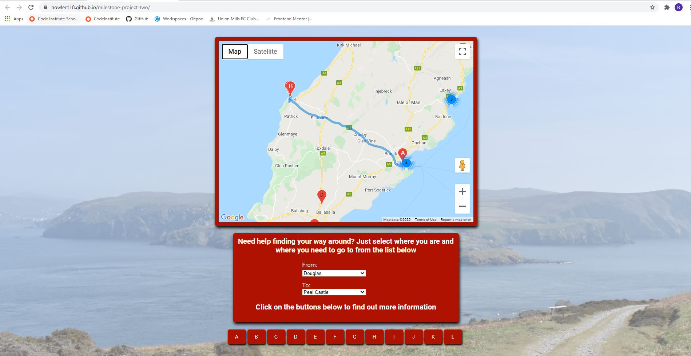

# Milestone project two - Isle of Man tourist information website 
The Isle of Man is often considered the motorcycling capital of the world with the annual Tourist Trophy (TT) races drawing thousands of tourists to the island. With COVID halting tourism globally, this has already lead to the postponement of the 2020 TT and could eventually lead to the full cancellation of the TT races full stop! This would damage tourism on the island so the island needs to find ways to boost tourism and draw interest in the island.

The website aims to provide summary information to potential tourists before they visit the island. The information is provided in summary form as people do not want to trawl through pages and pages of information. This can be quite off putting. 

[Click here to view the live website](https://howler118.github.io/milestone-project-two/)

# User Experience
## User stories
#### External Users 

- Potential tourists visiting the island
- People looking to move to the island

#### External User Goals

- Tourists
    - As a tourist, I want to know the best places to visit
    - As a tourist, I want to be able to find my way round the island
    - As a tourist, I want to know the important information about the island
    - As a tourist, I want to be able to interact with the website

- People moving to the island
    - As someone potentially moving to the island, I want to know the important information about the island
    - As someone potentially moving to the island, I want to be able to find my way round the island
    - As someone potentially moving to the island, I want to be able to interact with the website

#### Site Owner Goals

- As the site owner I want to help attract more visitors to island

# Design

Colour Scheme

- The main colours used for website was red (#b01200) and white. This was because Manx flag is mainly red and white text stands out well on the slightly dark red background.

Typography

- For the heading at the top of the page I used Permanent Marker. I used it as it is informal but striking. For the other headings and text I used Roboto. I liked the look of it so thought I would use it throughout the website.

Imagery

- The images used were vital to the UX as they tell the user what the website was about without having to read through. As the website is focused on the Isle of Man I made sure to use plenty of images of the island. I could describe the island in great detail but pictures are much more powerful. I used one of my own pictures in the welcome section as I always believe the first thing a user should come across on a website is a striking picture to grab their attention. I used my own images for the background of the other sections just to make the sections stand out.

 Wireframes

 - The Wireframes for the website are available to view in the repository

### Existing Features
- Flip cards in the basic info section to give users bitsize information about the island
- Form on the contact us page which allows users to submit feedback on the website
- The website is responsive and works on all devices
- Google Maps API with markers to show the top things to do and see on the island
- Directions API to map routes between two destinations
- Links for all the websites or Facebook pages of the top things to do/see on the island

### Features left to implement

- A picture slideshow which automatically cycles through pictures of the island
- Place API to allow users to search for places on the island other than the ones listed on the site
- Ability to select a language for the website

# Technologies Used

### Languages Used

- HTML5
- CSS3
- Javascript
- JQuery

### Frameworks, Libraries and Programs Used

- Google Fonts:

Google fonts were used on all pages on my website. I imported two fonts "Permanent Marker" which was used website heading and "Roboto" which was used for paragraphs and all the other headings.

- Font Awesome:

Font awesome was used throughout my website to add icons to various headings to make them stand out more and look different from one and other.

- Git

Git was used for version control (using the Gitpod terminal)

- Github

Github was used to store the project

- Balsamiq

Was used to create my wireframes for the project

- Jasmine

Was used to add automated test scripts

# Testing

## Code Validation

Initially I wanted to make sure that all syntax used was valid on my website so used the [W3C Markup Validator](https://validator.w3.org/#validate_by_input), [W3C CSS Validator](https://jigsaw.w3.org/css-validator/#validate_by_input) and [JSHintW3C Markup Validator](https://jshint.com/) respectively.

#### Upon checking my JS file there were no errors

#### Upon checking my CSS file there was one error:

1) 563 Parse Error [,]

To clear this error I just removed the extra comma after the last targeted element.

#### Upon checking index.html there were three errors:

1) The center element is obsolete. Use CSS instead. From line 266, column 25; to line 266, column 32
2) The center element is obsolete. Use CSS instead. From line 289, column 25; to line 289, column 32
3) The center element is obsolete. Use CSS instead. From line 313, column 25; to line 313, column 32

To clear the errors, I removed the "center" tag from my html file and replaced it with a normal div. In my CSS file I targeted this new div and positioned it centrally within its container.

#### Upon checking contact.html there were no errors

## Live Website Testing

Thorough testing was done on the live website on laptop/pc, mobile and tablet device screensizes. The testing undertaken is listed below.

1) Navigation to specified sections from the header
    - Welcome section
        - When I landed on the website, I clicked on the "Welcome" link in the navigation bar at the top to see if the user is taken to the "Welcome" section.
        - The user is taken to the "Welcome" section as expected

    - Basic Information section
        - When I landed on the website, I clicked on the "Basic Information" link in the navigation bar at the top to see if the user is taken to the "Basic Information" section.
        - The user is taken to the "Basic Information" section as expected

    - Did you know section
        - When I landed on the website, I clicked on the "Did you know" link in the navigation bar at the top to see if the user is taken to the "Did you know" section.
        - The user is taken to the "Did you know" section as expected

    - Things to do section
        - When I landed on the website, I clicked on the "Things to do" link in the navigation bar at the top to see if the user is taken to the "Things to do" section.
        - The user is taken to the "Things to do" section as expected

    - Contact us section
        - When I landed on the website, I clicked on the "Contact us" link in the navigation bar at the top to see if the user is taken to the "Contact us" section.
        - The user is taken to the "Contact us" section as expected

2) Basic Information Section flip cards
    - Capital flip card
        - When I clicked the card it flipped over to reveal the other side as expected
        - When I clicked the card a second time the card flipped back over as expected

    - Population flip card
        - When I clicked the card it flipped over to reveal the other side as expected
        - When I clicked the card a second time the card flipped back over as expected

    - Language flip card
        - When I clicked the card it flipped over to reveal the other side as expected
        - When I clicked the card a second time the card flipped back over as expected

    - Flag flip card
        - When I clicked the card it flipped over to reveal the other side as expected
        - When I clicked the card a second time the card flipped back over as expected

    - Currency flip card
        - When I clicked the card it flipped over to reveal the other side as expected
        - When I clicked the card a second time the card flipped back over as expected

    - Nationality flip card
        - When I clicked the card it flipped over to reveal the other side as expected
        - When I clicked the card a second time the card flipped back over as expected

    - Climate flip card
        - When I clicked the card it flipped over to reveal the other side as expected
        - When I clicked the card a second time the card flipped back over as expected

    - Government flip card
        - When I clicked the card it flipped over to reveal the other side as expected
        - When I clicked the card a second time the card flipped back over as expected

    - Work Permit flip card
        - When I clicked the card it flipped over to reveal the other side as expected
        - When I clicked the card a second time the card flipped back over as expected

    - Reset cards
        - I clicked several cards and then moved the mouse cursor out of the basic info section to see if the everything would reset
        - Cards that I had flipped over, reset as expected
        - Cards that I did not flip over, were unaffected as expected

3) Basic Information Section links (all screen sizes)
    - Population card link
        - I flipped the "Population" card over and click on the link
        - The link to the Government website opened in a new tab as expected

    - Government card link
        - I flipped the "Government" card over and click on the link
        - The link to the Government website opened in a new tab as expected

4) Did you know section buttons
    - Hide/Show contents
        - When I go to the "Did you know" section, I clicked on the "Hide/Show Contents" button
        - All divs in the foreground are hidden to show the background image as expected
        - When I click the button again, the divs are displayed again as expected

    - Isle of Women button
        - When I go to the "Did you know" section, I clicked on the "Isle of Women" button
        - The Isle of Women question is the default one so when I clicked on the button nothing happened as expected
        - After clicking on either the "Stayin' Alive" or "Purrrr-fect" button, I then clicked on "Isle of Women" button and the display changed to Isle of Women question as expected 

    - Stayin' Alive button
        - When I go to the "Did you know" section, I clicked on the "Stayin' Alive" button
        - After clicking on the "Stayin' Alive" button, the Bee Gees question is displayed as expected
        - I clicked on the button again and nothing happens as expected 

    - Purrr-fect button
        - When I go to the "Did you know" section, I clicked on the "Purrr-fect" button
        - After clicking on the "Purrr-fect" button, the Manx Cat question is displayed as expected
        - I clicked on the button again and nothing happens as expected 

    - Input box (Isle of Women Question)
        - I tried to input text into the box (which requires the user to guess a year) and I was unable to do so as expected
        - I tried to input symbols/special characters into the box (which requires a year) and I was unable to do so as expected

    - Guess button (Isle of Women Question)
        - I clicked on the guess button (without inputting a year) and it displays text saying "Come on, have a guess" as expected
        - I clicked on the guess button (after inputting 1881) and it displays text saying "Correct" as expected
        - I clicked on the guess button (after inputting a year other than 1881) and it displays different text depending on the year input as expected

    - Give up button (Isle of Women Question)
        - I clicked on the Give up button and the input box is removed and replaced with the correct answer and some additional text as expected

    - Reset button (Isle of Women Question)
        - I clicked on the Reset button and the input box is display again, the question its original state as expected
    
    - Input box (Stayin Alive)
        - I tried to input text into the box (which requires the user to guess a number) and I was unable to do so as expected
        - I tried to input symbols/special characters into the box (which requires a number) and I was unable to do so as expected

    - Guess button (Stayin Alive)
        - I clicked on the guess button (without inputting a figure) and it displays text saying "Come on, have a guess" as expected
        - I clicked on the guess button (after inputting 120) and it displays text saying "Correct" as expected
        - I clicked on the guess button (after inputting a figure other than 120) and it displays different text depending on the year input as expected

    - Give up button (Stayin Alive)
        - I clicked on the Give up button and the input box is removed and replaced with the correct answer and some additional text as expected
        
    - Reset button (Stayin Alive)
        - I clicked on the Reset button and the input box is display again, the question its original state as expected

    - Leg button (Purrrr-fect)
        - I clicked on the "Tail" button and it displays text "Correct" as expected

    - Tail button (Purrrr-fect)
        - I clicked on the "Leg" button and it displays text "Nope, try again!" as expected

    - Toes button (Purrrr-fect)
        - I clicked on the "Toes" button and it displays text "Try again!" as expected

    - Give up button (Purrrr-fect)
        - I clicked on the Give up button and the input box is removed and replaced with the correct answer and some additional text as expected
        
    - Reset button (Purrrr-fect)
        - I clicked on the Reset button and the input box is display again, the question its original state as expected

5) Things to do section buttons
    - Hide/Show contents
        - When I go to the "Things to do" section, I clicked on the "Hide/Show Contents" button
        - All divs in the foreground are hidden to show the background image as expected
        - When I click the button again, the divs are displayed again as expected

    - Directions 
        - In the "From" box, I selected "Douglas" and in the "To" box I selected "The Tea Junction"
        - The route is displayed within the map as expected
        - In the "From" box, I selected "Douglas" and in the "To" box I selected "Portofino Restaurant"
        - The route is displayed within the map as expected
        - In the "From" box, I selected "Douglas" and in the "To" box I selected "Jaks Bar and Steakhouse"
        - The route is displayed within the map as expected
        - In the "From" box, I selected "Douglas" and in the "To" box I selected "Onchan"
        - The route is displayed within the map as expected
        - In the "From" box, I selected "Douglas" and in the "To" box I selected "Ocean Views and Grill"
        - The route is displayed within the map as expected
        - In the "From" box, I selected "Douglas" and in the "To" box I selected "Laxey"
        - The route is displayed within the map as expected
        - In the "From" box, I selected "Douglas" and in the "To" box I selected "The Shed"
        - The route is displayed within the map as expected
        - In the "From" box, I selected "Douglas" and in the "To" box I selected "La Mona Lisa"
        - The route is displayed within the map as expected
        - In the "From" box, I selected "Douglas" and in the "To" box I selected "Laxey Wheel"
        - The route is displayed within the map as expected
        - In the "From" box, I selected "Douglas" and in the "To" box I selected "Castletown"
        - The route is displayed within the map as expected
        - In the "From" box, I selected "Douglas" and in the "To" box I selected "Castle Rushen"
        - The route is displayed within the map as expected
        - In the "From" box, I selected "Douglas" and in the "To" box I selected "Silverdale Glen Cafe"
        - The route is displayed within the map as expected
        - In the "From" box, I selected "Douglas" and in the "To" box I selected "Peel"
        - The route is displayed within the map as expected
        - In the "From" box, I selected "Douglas" and in the "To" box I selected "Peel Castle"
        - The route is displayed within the map as expected
        - In the "From" box, I selected "Douglas" and in the "To" box I selected "Port Erin"
        - The route is displayed within the map as expected
        - In the "From" box, I selected "Douglas" and in the "To" box I selected "The Cafe at the Sound"
        - The route is displayed within the map as expected
        - In the "From" box, I selected "Douglas" and in the "To" box I selected "Ramsey"
        - The route is displayed within the map as expected
        - In the "From" box, I selected "Douglas" and in the "To" box I selected "Kirk Michael"
        - The route is displayed within the map as expected
        - In the "From" box, I selected "Douglas" and in the "To" box I selected "St John's"
        - The route is displayed within the map as expected
        - In the "From" box, I selected "Douglas" and in the "To" box I selected "Port St Mary"
        - The route is displayed within the map as expected

    - Location buttons
        - I clicked on each of the button (labelled A-L) and it display information about the different locations on the map as expected
        - I clicked on each of the links and they opened in a new tab as expected

6) Contact us section buttons
    - Hide/Show contents
        - When I go to the "Contact us" section, I clicked on the "Hide/Show Contents" button
        - All divs in the foreground are hidden to show the background image as expected
        - When I click the button again, the divs are displayed again as expected

7) Contact us form
    - Before inputting any information, I pressed the submit button at the bottom of the form which brought up an error asking the user to fill out the 'your issue/feedback' field
    - This was as expected as it is a mandatory field
    - I input some text into this field only and tried to submit again which brought up an error asking the user to fill out the description field
    - This was as expected as it is a mandatory field
    - I input some text into this field and tried to submit again which brought up an error asking the user to fill out the email field
    - This was as expected as it is a mandatory field
    - I input some text into this field and tried to submit again which brought up an error specifying that the '@' symbol was missing
    - This was as expected as the field has a specific format with the email address expected to contain the '@' symbol
    - I added the symbol and submitted again
    - This time the form submits successfully and the user is taken to contact.html which advises the user's feedback enquiry has been sucessfully received
    - This was as expected as there were no other mandatory fields in the feedback form

8) contact.html
    - After testing the feedback form, the user lands on contact.html which advises the user that they have successfully submitted their website feedback
    - I clicked on the "Back to home page" link which navigates to the home page as expected

# Testing User Stories from User Experience (UX) Section

## Tourists

#### 1) As a tourist, I want to know the best places to visit
- Upon entering the site, the user automatically lands on the home page.

  

- The user can either click on "Things to do" in the navigation bar or scroll down the page until they get to the section

  

  

- The user can see several markers on the map and are instructed to click on the buttons (A-L) below the map
- Each button displays details about the corresponding marker on the map

  

   

- The users can click on the link to find out more information regarding the chosen place

#### 2) As a tourist, I want to be able to find my way round the island 
- Upon entering the site, the user automatically lands on the home page.

  

- The user can either click on "Things to do" in the navigation bar or scroll down the page until they get to the section
- The user is presented with a map of the Isle of Man

  

  

- The user can use the map to explore the island and find their way around
- If they need specific directions between towns and villages, or possibly one of the top things to do, then they can use the two drop downs below to plan a route

  

  

- The drop downs allow users to plan a journey between the major towns and villages

#### 3) As a tourist, I want to know the important information about the island
- Upon entering the site, the user automatically lands on the home page.

  

- The user can either click on "Basic Information" in the navigation bar or scroll down the page until they get to the section
- The user is presented with a grid with headings for the key information they would need to know

  

  

- In the section heading, the text instructs the users click on the tiles to reveal more information
- The user can click on which ever one (or all) the tiles

#### 4) As a tourist, I want to be able to interact with the website
- Upon entering the site, the user automatically lands on the home page.

  

- The user can interact with website as part of achieving the previous user goals
- They can also interact in the "Did you know" section
- The user can either click on "Did you know" in the navigation bar or scroll down the page until they get to the section

  

  

- The user can have a go at the 3 questions in the section and see how they get on

## Someone potentially moving to the island

#### 1) As someone potentially moving to the island, I want to know the important information about the island
- Upon entering the site, the user automatically lands on the home page.

  

- The user can either click on "Basic Information" in the navigation bar or scroll down the page until they get to the section
- The user is presented with a grid with headings for the key information they would need to know

  

  

- In the section heading, the text instructs the users click on the tiles to reveal more information
- The user can click on which ever one (or all) the tiles

#### 2) As someone potentially moving to the island, I want to be able to find my way round the island
- Upon entering the site, the user automatically lands on the home page.

  

- The user can either click on "Things to do" in the navigation bar or scroll down the page until they get to the section
- The user is presented with a map of the Isle of Man

  

  

- The user can use the map to explore the island and find their way around
- If they need specific directions between towns and villages, or possibly one of the top things to do, then they can use the two drop downs below to plan a route

  

  

- The drop downs allow users to plan a journey between the major towns and villages

#### 3) As someone potentially moving to the island, I want to be able to interact with the website
- Upon entering the site, the user automatically lands on the "Home" page.

  

- The user can interact with website as part of achieving the previous user goals
- They can also interact in the "Did you know" section
- The user can either click on "Did you know" in the navigation bar or scroll down the page until they get to the section

  

  

- The user can have a go at the 3 questions in the section and see how they get on

# Further Testing

1) The website was tested on three different internet browsers
    - Google Chrome
    - Microsoft Edge
    - Internet Explorer 11

2) All links on the website were clicked on to make sure they work as expected. All links opened as expected.

3) The website was viewed (all pages) on various mobile and tablet devices by using the Inspect feature. The following devices were tested
    - Moto G4
    - Galaxy S5
    - Pixel 2
    - Pixel 2L
    - iPhone 5/SE
    - iPhone 6/7/8
    - iPhone 6/7/8 plus
    - iPhone X 
    - iPad
    - iPad Pro
    - Surface Duo
    - Galaxy Fold

4) The website was tested on an actual iPhone 11 in addition to laptop/PC. 

# Deployment
#### GitHub Pages
The following steps were taken to deploy the project in Github Pages
1) Logged into Github
2) Went to the repository for my milestone project one
3) Clicked on settings
4) Scrolled down to GitHub pages
5) Underneath the "source" heading, change "none" to "master" and click save.
6) After saving refresh the page (if it does not automatically) and then the link to the live website will be available

#### Local Deployment
The following steps were taken to download a copy of the repository to my desktop
1) Logged into GitHub
2) Navigated to the repository for this project, 'howler118/milestone-project-one'
3) Clicked on the green code button and copied the url for the repository
4) Opened git bash
5) Changed the director to my milestone one project folder on my pc
6) Enter git clone and pasted the url for my repository
7) Once the download was completed I checked the porject folder on my pc and the repository downloaded as expected

# Credits

#### Code

- w3schools.com - used to quickly look up various element tags
- w3schools.com - specifically used to work out [how to make a flip card](https://www.w3schools.com/howto/howto_css_flip_card.asp)
- Code Institute for the course materials and general support
- stackoverflow - was used to see if other programmers were having similar problems with certain syntax.
- https://stackoverflow.com/questions/48070987/how-to-get-user-input-from-javascript-form - I read this post to help figure out how to take user input from a input box and run it through a JS function
- Google Developer - used for adding marker clusters to my map https://developers.google.com/maps/documentation/javascript/marker-clustering
- Google Developer - used for adding Directions API to map section https://developers.google.com/maps/documentation/javascript/examples/directions-simple#maps_directions_simple-javascript

#### Content
    
All content was written by the developer

#### Media

- The background images for each section were images pictures I took myself
- The image of the Manx flag (basic info section) was obtained from [here](https://www.google.com/search?q=isle+of+man+flag&rlz=1C1CHBF_enIM911IM911&sxsrf=ALeKk00mvJ_B0gUajx3jI6FcsBxXV5vACw:1605353818139&source=lnms&tbm=isch&sa=X&ved=2ahUKEwjUhMaA-YHtAhWNQRUIHd08CRQQ_AUoAXoECBwQAw&biw=1920&bih=880#imgrc=tlZeqaBEcsE7eM)
- The image of the Manx five pound note (basic info section) was obtained from [here](https://www.google.com/search?q=isle+of+man+five+pound&tbm=isch&ved=2ahUKEwjrsoWZ-YHtAhUs5IUKHfgIBHMQ2-cCegQIABAA&oq=isle+of+man+five+pound&gs_lcp=CgNpbWcQA1CJ6wFY3PABYKryAWgAcAB4AIABYIgBYJIBATGYAQCgAQGqAQtnd3Mtd2l6LWltZ8ABAQ&sclient=img&ei=jcGvX6u4HqzIlwT4kZCYBw&bih=880&biw=1920&rlz=1C1CHBF_enIM911IM911#imgrc=oeF72dLoXZtUSM)

- The image of the Sound Cafe (map section) was obtained from [here](https://www.google.com/search?q=the+sound+cafe&rlz=1C1CHBF_enIM911IM911&sxsrf=ALeKk01npuQixOoY5GFPzXDAScbek-JuyQ:1605553256750&source=lnms&tbm=isch&sa=X&ved=2ahUKEwi8-6T834ftAhVNecAKHS9bAGwQ_AUoAXoECCMQAw&biw=1920&bih=880#imgrc=0F-jYe8lnLMBqM)
- The image of the Shed (map section) was obtained from [here](https://www.google.com/search?q=the+shed&rlz=1C1CHBF_enIM911IM911&sxsrf=ALeKk00rGh1XlYQCD_p-w-A8FEvl1G0kLg:1605552749499&source=lnms&tbm=isch&sa=X&ved=2ahUKEwir67SK3oftAhWKYsAKHQZsCrUQ_AUoAXoECCYQAw&biw=1920&bih=937#imgrc=fM4aWYQIW-i4dM)
- The image of the Tea Junction (map section) was obtained from [here](https://www.google.com/search?q=the+tea+junction&tbm=isch&ved=2ahUKEwi55c6L3oftAhXG0YUKHQeyDmgQ2-cCegQIABAA&oq=the+tea+jun&gs_lcp=CgNpbWcQARgAMgIIADIECAAQGDIECAAQGDIECAAQGDIECAAQGDIECAAQGDIECAAQGDIECAAQGDIECAAQGDIECAAQGDoECAAQQzoECCMQJzoGCAAQCBAeUMLJGViY3Blg3-IZaABwAHgAgAF2iAGxCJIBAzguM5gBAKABAaoBC2d3cy13aXotaW1nwAEB&sclient=img&ei=cMqyX7ltxqOXBIfkusAG&bih=937&biw=1920&rlz=1C1CHBF_enIM911IM911#imgrc=c-UUj43e7uIFVM)
- The image of Silverdale Glen Cafe (map section) was obtained from [here](https://www.google.com/search?q=silverdale+glen+cafe&rlz=1C1CHBF_enIM911IM911&sxsrf=ALeKk03FZs1TRHNNyEbVKWsAMeAIzrSlWA:1605553291720&source=lnms&tbm=isch&sa=X&ved=2ahUKEwjJuvuM4IftAhW7QkEAHa2mCCIQ_AUoAXoECCIQAw&biw=1920&bih=880#imgrc=2pjxiOWVUoOdBM)

- The image of La Mona Lisa restaurant (map section) was obtained from [here](https://www.google.com/search?q=mona+lisa+iom&rlz=1C1CHBF_enIM911IM911&sxsrf=ALeKk03gHQDOMaNRKi_-8ALqt2e0ttN2yA:1605553423444&source=lnms&tbm=isch&sa=X&ved=2ahUKEwiRn-PL4IftAhUIAcAKHaBvD9wQ_AUoAXoECCQQAw&biw=1920&bih=880#imgrc=yHhn4W0vpBFnpM)
- The image of Ocean Views Bar & Grill (map section) was obtained from [here](https://www.google.com/search?q=ocean+views+restaurant+iom&tbm=isch&ved=2ahUKEwi16ajm4IftAhWU0YUKHclsDTQQ2-cCegQIABAA&oq=ocean+views+restaurant+iom&gs_lcp=CgNpbWcQAzoECCMQJzoECAAQGFCCZliyhQFgnYYBaAFwAHgAgAHDAYgBgQmSAQQxMS4xmAEAoAEBqgELZ3dzLXdpei1pbWfAAQE&sclient=img&ei=R82yX_WpBpSjlwTJ2bWgAw&bih=880&biw=1920&rlz=1C1CHBF_enIM911IM911#imgrc=ZhLM8MnuSAwqAM)
- The image of Jaks restaurant (map section) was obtained from [here](https://www.google.com/search?q=jaks&rlz=1C1CHBF_enIM911IM911&sxsrf=ALeKk01o9y6O87anfU0wT8tnsmJDIocM1Q:1605553612062&source=lnms&tbm=isch&sa=X&ved=2ahUKEwj-xNul4YftAhXOesAKHckfDoEQ_AUoAnoECCQQBA&biw=1920&bih=880#imgrc=JVJgx_o8-05F5M)
- The image of Portofino Restaurant (map section) was obtained from [here](https://www.google.com/search?q=portofino+restaurant+douglas+isle+of+man&tbm=isch&ved=2ahUKEwjWpqy24YftAhXWwoUKHVeIBYMQ2-cCegQIABAA&oq=portofino+restaurant+d&gs_lcp=CgNpbWcQARgBMgYIABAIEB4yBAgAEBgyBAgAEBgyBAgAEBgyBAgAEBgyBAgAEBgyBAgAEBgyBAgAEBgyBAgAEBgyBAgAEBg6AggAULdCWIJNYMlXaABwAHgAgAF7iAHbAZIBAzEuMZgBAKABAaoBC2d3cy13aXotaW1nwAEB&sclient=img&ei=7s2yX9b3ONaFlwTXkJaYCA&bih=880&biw=1920&rlz=1C1CHBF_enIM911IM911#imgrc=hmR1ebY9frg6mM)

- The image of Castle Rushen (map section) was obtained from [here](https://www.google.com/search?q=castle+rushen&tbm=isch&ved=2ahUKEwiklLeP4oftAhUa_BoKHTZsDkUQ2-cCegQIABAA&oq=castle+rushen&gs_lcp=CgNpbWcQAzICCAAyAggAMgIIADICCAAyBAgAEEMyAggAMgIIADICCAAyAggAMgYIABAFEB46BAgjECdQsJcCWJWyAmDKtAJoAHAAeACAAaMBiAGzC5IBBDEyLjOYAQCgAQGqAQtnd3Mtd2l6LWltZ8ABAQ&sclient=img&ei=qc6yX-SbLpr4a7bYuagE&bih=880&biw=1920&rlz=1C1CHBF_enIM911IM911#imgrc=iTly74-kFIlh-M)
- The image of Peel Castle (map section) was obtained from [here](https://www.google.com/search?q=peel+castle+isle+of+man&tbm=isch&ved=2ahUKEwjauIiB4oftAhVCyRoKHTkHBIMQ2-cCegQIABAA&oq=peel+cas&gs_lcp=CgNpbWcQARgAMgQIABBDMgIIADICCAAyAggAMgIIADICCAAyAggAMgIIADICCAAyAggAOgQIIxAnUJnXAVjn3AFg9eIBaABwAHgAgAHLAogB8wiSAQczLjMuMS4xmAEAoAEBqgELZ3dzLXdpei1pbWfAAQE&sclient=img&ei=i86yX5rHJsKSa7mOkJgI&bih=880&biw=1920&rlz=1C1CHBF_enIM911IM911#imgrc=k09-GKgALEtoHM)
- The image of Laxey Wheel (map section) was obtained from [here](https://www.google.com/search?q=laxey+wheel&rlz=1C1CHBF_enIM911IM911&sxsrf=ALeKk010iaGVlKha5hPzBSvn2ToKzZykMA:1605553905125&source=lnms&tbm=isch&sa=X&ved=2ahUKEwiV3Lqx4oftAhUgQ0EAHbv3BhcQ_AUoAXoECCcQAw&biw=1920&bih=880#imgrc=3wpuKaXfp6ayWM)
- The image of the Calf of Man (map section) was obtained from [here](https://www.google.com/search?q=calf+of+man&rlz=1C1CHBF_enIM911IM911&sxsrf=ALeKk02YbtOX2wTN8pgnSFGt2hzPFkoCSg:1605553801729&source=lnms&tbm=isch&sa=X&ved=2ahUKEwiu9ZOA4oftAhUTilwKHT5VBOIQ_AUoAXoECBoQAw&biw=1920&bih=880#imgrc=aMSRtm2w8CBl4M)

- The image of Lydia Becker (Did you know section) was obtained from [here](https://www.google.com/search?q=lydia+becker&rlz=1C1CHBF_enIM911IM911&sxsrf=ALeKk00MuA6yKHx_0qd33z7u-VzTswaegA:1605819490813&source=lnms&tbm=isch&sa=X&ved=2ahUKEwiFycriv4_tAhXUN8AKHaZIA5oQ_AUoAXoECBcQAw&biw=1920&bih=937#imgrc=3iYGrSFXVMmsFM)
- The image of the Bee Gees (Did you know section) was obtained from [here](https://www.google.com/search?q=the+bee+gees&rlz=1C1CHBF_enIM911IM911&sxsrf=ALeKk00LIvW5cCBPhd88xZXWWKH2rstpfg:1606076797185&source=lnms&tbm=isch&sa=X&ved=2ahUKEwjok-mn_pbtAhXTa8AKHYD5CpIQ_AUoAXoECCgQAw&biw=1920&bih=937#imgrc=PERlWSHRtjbP-M)
- The image of the cat (Did you know section) was one of my own pictures

#### Acknowledgements

- My mentor for the feedback throughout the project at each mentor session
- Code Institute for the course materials and general support
- Google Developer for use of the Maps API and guidance notes